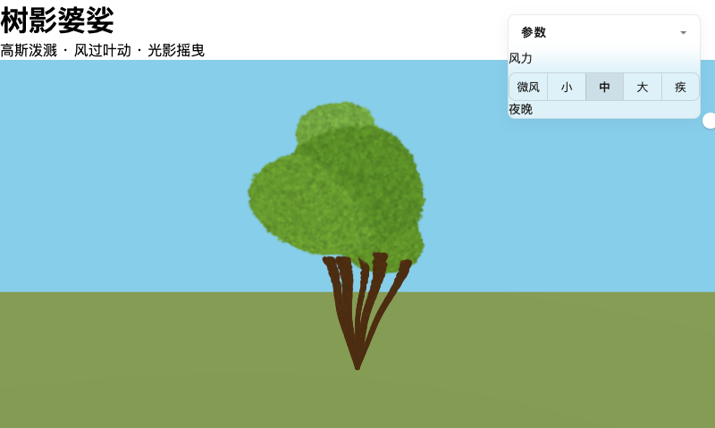
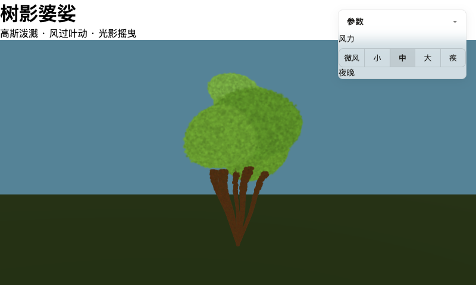

# 树影婆娑 · Dappled Shade

一棵程序化树（高斯泼溅渲染），在平面上投下光影，随风摇曳。纯浏览器端 · 免构建 · 免打包。




## 效果

- 🌳 **程序化高斯泼溅树** — 分形枝干 + 叶团，70 万 splat 在 GPU 逐点绘制
- 💨 **风力五档** — 微/小/中/大/疾，每帧在 splat 顶点注入风位移（W 键 / 面板）
- 🌙 **昼夜切换** — 天空/地面/光照强度插值，夜晚冷蓝月光（S 键 / 面板）
- 📱 **移动端适配** — 面板改底部横条，触控目标 ≥44px，默认收起

## 运行

任意静态服务器：

```bash
python3 -m http.server 8765
```

打开 `http://localhost:8765`。页面从 esm.sh 拉取 Spark + three 依赖（首次需要外网）。

## 在线预览

| 平台 | 地址 |
|------|------|
| GitHub Pages | https://gandli.github.io/dappled-shade/ |
| Vercel | https://dappled-shade.vercel.app |
| Cloudflare Workers | https://dappled-shade.dappled-shade.workers.dev |

## 交互

| 操作 | 效果 |
|------|------|
| 拖动 | 旋转视角 |
| `S` / 夜晚开关 | 昼夜切换 |
| `W` / 风力分段 | 风力五档 |
| 右上角「参数」 | 折叠控制面板（移动端默认收起） |

## 技术栈

- [Spark](https://sparkjs.dev) — 3D Gaussian Splatting 渲染器（Three.js 生态）
- [Three.js](https://threejs.org) — 场景、光照、色调映射
- [dyno](https://github.com/sparkjsdev/spark) — GPU 计算图，逐 splat 风位移注入
- 程序化 `constructSplats` — 免外部 26MB 资产，纯 JS 生成

## 结构

```
index.html   入口 + importmap + 控制面板
main.js      场景/程序化树/风力/昼夜接线
style.css    面板样式 + 移动端媒体查询
check.py     结构自检（python3 check.py）
```

## 结构自检

```bash
python3 check.py
```

校验 Spark 接线、风动 modifier 时序、昼夜插值、面板接线是否齐全。
